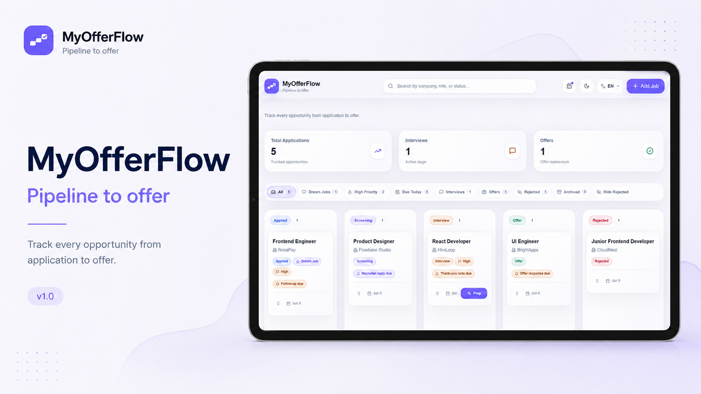
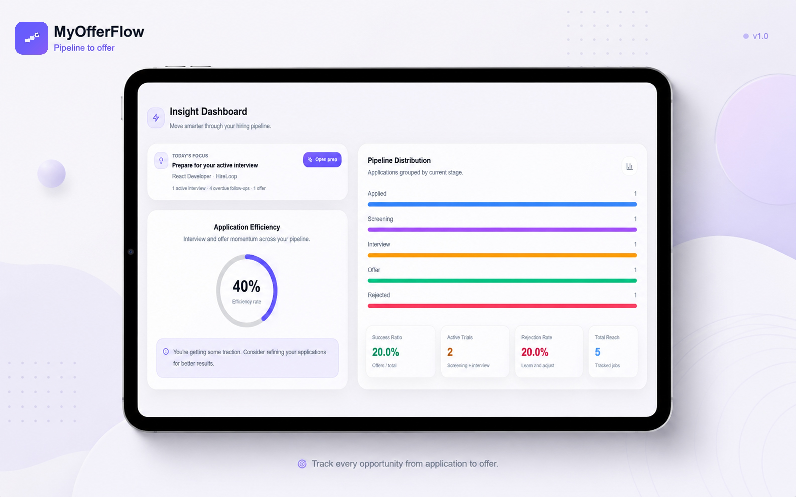

# MyOfferFlow

<p align="center">
  
</p>

<p align="center">
  <strong>A focused job application tracker for managing the full journey from application to offer.</strong>
</p>

<p align="center">
  MyOfferFlow helps job seekers organize applications, interviews, follow-ups, goals, preparation tasks, and offers in one clean productivity workspace.
</p>

<p align="center">
  <a href="https://myofferflow.pages.dev"><strong>Live Demo</strong></a>
  ·
  <a href="#features">Features</a>
  ·
  <a href="#product-preview">Product Preview</a>
  ·
  <a href="#technical-overview">Technical Overview</a>
  ·
  <a href="#roadmap">Roadmap</a>
  ·
  <a href="#license">License</a>
</p>

<p align="center">
  
  
  
  
</p>

---

## Overview

MyOfferFlow is a modern job application tracking dashboard designed to help job seekers manage their hiring pipeline with more structure, clarity, and consistency.

Job searching often becomes scattered across spreadsheets, emails, notes, job boards, calendars, and memory. MyOfferFlow brings the core workflow into one focused interface: tracking applications, planning follow-ups, preparing for interviews, setting goals, and reviewing progress.

The project is built as a polished SaaS-style frontend product with responsive layouts, multilingual UI, light and dark themes, browser-based persistence, and an app-like experience on mobile and tablet devices.

---

## Features

### Kanban Job Pipeline

MyOfferFlow uses a visual Kanban board to track applications across the main hiring stages:

* Applied
* Screening
* Interview
* Offer
* Rejected

Job cards can be moved between columns to update their current status. Each stage uses stable internal identifiers, while visible labels are localized through the interface language.

### Application Management

Users can create and edit detailed job application records.

Each application can include:

* Company
* Role
* Location
* Job link
* Source
* Status
* Priority
* Dream Job preference
* Application date
* Next action
* Due date
* Follow-up reminder
* Notes

The application drawer is designed to work across desktop, tablet, and mobile screens.

### Smart Filters

The board includes quick filters for focusing on specific parts of the job search pipeline:

* All
* Dream Jobs
* High Priority
* Due Today
* Interviews
* Offers
* Rejected
* Archived
* Hide Rejected

Filter counts are derived from the current application state.

### Interview Preparation

MyOfferFlow includes an interview preparation flow for creating structured preparation plans based on role, company, interview type, and job context.

The preparation system is designed to support:

* Technical questions
* Behavioral questions
* Answer strategy
* Focus areas
* Preparation notes
* Interview-specific planning

A future version may expand this into a dedicated AI interview preparation agent.

### Smart Planner

The Smart Planner helps users organize job search actions by day and week.

Planner tasks can include:

* Interview preparation
* Follow-ups
* Thank-you notes
* Recruiter responses
* Offer review tasks
* Manual custom tasks

Tasks can be connected to application data, so the planner reflects the current state of the hiring pipeline.

### Insight Dashboard

The Insight Dashboard provides a high-level overview of job search progress.

It includes:

* Today’s focus
* Pipeline distribution
* Application efficiency
* Success ratio
* Active trials
* Rejection rate
* Total reach

These metrics help users understand where their applications are concentrated and how their current job search strategy is progressing.

### Career Goals

Career Goals allow users to set and track job search targets.

Supported goal types include:

* Applications
* Interviews
* Follow-ups
* Interview preparation
* Offers
* Custom goals

Goal progress can be calculated from current application and planner data where possible.

### Themes

MyOfferFlow supports both light and dark themes.

Theme behavior includes:

* Light mode as the default experience
* Persistent theme preference
* Theme-aware cards, inputs, filters, badges, drawers, and dashboard sections
* Responsive visual consistency across screen sizes

### Localization

MyOfferFlow supports four interface languages:

* English
* German
* Russian
* Ukrainian

The localized interface covers navigation, filters, forms, drawers, planner views, interview preparation, career goals, insight cards, empty states, validation messages, and footer content.

User-generated content such as company names, job titles, notes, job descriptions, and custom tasks is not automatically translated.

### Responsive and PWA-Ready Experience

MyOfferFlow is designed for:

* Desktop
* Laptop
* Tablet
* Mobile browser usage

The interface includes responsive layouts, touch-friendly controls, horizontal scrolling where appropriate, adaptive drawers, and mobile-safe actions.

Users can also add the deployed web application to their device home screen for an app-like browser experience.

---

## Product Preview

### Insights and Goals

MyOfferFlow includes an analytics dashboard that helps users understand their job search progress, pipeline distribution, active opportunities, offer ratio, and overall application momentum.

<p align="center">
  
</p>

The dashboard is connected to the current application state, so metrics update as jobs move through the pipeline. This makes the product more than a simple Kanban board: it becomes a structured workspace for reviewing progress and improving job search strategy.

---

## Technical Overview

MyOfferFlow is a frontend-focused React application built around a lightweight local-first product architecture.

### Core Stack

* **React** — component-based interface architecture
* **Vite** — fast development tooling and optimized production builds
* **Tailwind CSS** — utility-first styling and responsive UI
* **JavaScript** — application logic and state handling
* **localStorage** — browser-based persistence for user data and preferences
* **Custom i18n layer** — multilingual interface support
* **PWA assets** — home screen installation support

### Data and State

Application data is persisted in the browser and acts as the source of truth for multiple product areas:

* Kanban columns
* Smart filter counts
* Insight metrics
* Career goal progress
* Planner tasks
* Follow-up reminders
* Interview preparation shortcuts

This keeps the current version lightweight and usable without a backend.

### Stable Status Logic

Application stages use stable internal values:

```txt
applied
screening
interview
offer
rejected
```

Visible status labels are translated separately through the localization system.

This prevents data and logic issues when switching between English, German, Russian, and Ukrainian.

### Goal Calculation Logic

Career Goals are connected to the current application and planner data where possible.

Examples:

* Interview goals count applications currently in the Interview stage.
* Offer goals count applications currently in the Offer stage.
* Application goals count jobs added or applied within a selected date range.
* Follow-up goals can be connected to completed follow-up tasks.
* Custom goals can use manual progress values.

Archived applications are excluded from active goal calculations by default.

### Planner Logic

The planner supports both manual and application-driven tasks.

Task generation can depend on:

* Application status
* Due dates
* Follow-up dates
* Interview status
* Offer status
* Next actions
* Reminder data

Task identity is kept independent from translated UI labels to keep planner behavior stable across language changes.

---

## Project Access

MyOfferFlow is available as a deployed web application:

```txt
https://myofferflow.pages.dev
```

This repository is published for portfolio and demonstration purposes only.

The source code is available for review, but it is not provided as an open-source template, starter kit, or reusable codebase.

Users are allowed to access and use the official deployed MyOfferFlow application as an end product through the authorized website.

---

## Mobile and Tablet Access

MyOfferFlow can be used directly from a browser on desktop, tablet, and mobile devices.

At this stage, MyOfferFlow does not have a native application in the Apple App Store or Google Play Store. Native iOS and Android applications may be considered in the future as the project grows.

### Add to Home Screen

On Android / Google Chrome:

1. Open MyOfferFlow in Google Chrome.
2. Tap the three-dot menu.
3. Select **Add to Home screen** or **Install app** if available.
4. Confirm the action.

On iPhone or iPad / Safari:

1. Open MyOfferFlow in Safari.
2. Tap the **Share** button.
3. Select **Add to Home Screen**.
4. Confirm the action.

---

## Roadmap

Planned future improvements include:

* AI interview preparation agent
* More advanced analytics and job search insights
* Optional cloud sync and user accounts
* Improved notification and reminder workflows
* More advanced goal templates
* Native iOS and Android applications in a future scaling phase

---

## Development Notice

This project is not provided as an open-source template or reusable starter kit.

Local development, production builds, redistribution, self-hosting, or deployment of this codebase are not permitted without explicit written permission from the author.

The repository is shared to demonstrate product design, frontend architecture, UI implementation, localization, responsive behavior, and workflow logic.

---

## License

All rights reserved.

This project is provided for portfolio and demonstration purposes only. The source code, design, structure, assets, and implementation may not be copied, modified, built, deployed, distributed, sublicensed, reused, or included in other projects without explicit written permission from the author.

Users are allowed to access and use the official deployed MyOfferFlow application as an end product through the authorized website.

You may not reverse engineer, reproduce, resell, redistribute, self-host, publish, or create derivative works based on the source code, design, or interface without permission.
